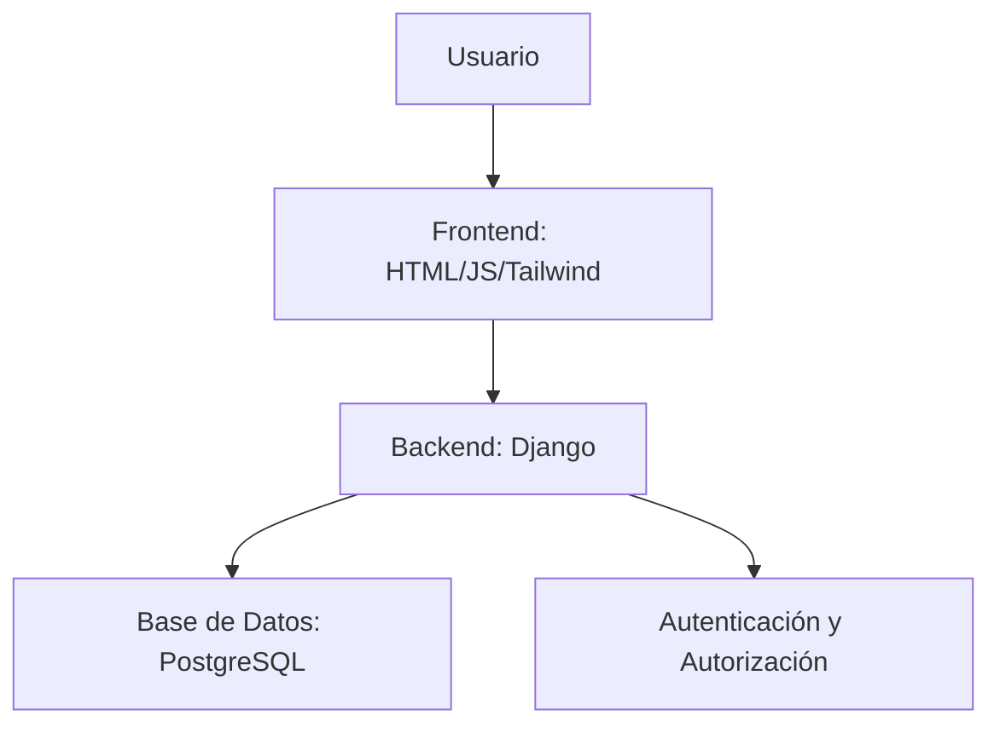

# Plan de Desarrollo de la Aplicación Web para Administración de Calificaciones de Colegio

## Índice

- [Plan de Desarrollo de la Aplicación Web para Administración de Calificaciones de Colegio](#plan-de-desarrollo-de-la-aplicación-web-para-administración-de-calificaciones-de-colegio)
  - [Índice](#índice)
  - [Introducción y Contexto](#introducción-y-contexto)
  - [Arquitectura del Sistema](#arquitectura-del-sistema)
  - [Especificaciones de Seguridad](#especificaciones-de-seguridad)
  - [Documentación Técnica](#documentación-técnica)
  - [Preparación del Entorno](#preparación-del-entorno)
  - [Configuración de la Base de Datos](#configuración-de-la-base-de-datos)
  - [Desarrollo Paso a Paso (MVP)](#desarrollo-paso-a-paso-mvp)
  - [Integración y Testing](#integración-y-testing)
  - [Despliegue Local](#despliegue-local)
  - [Troubleshooting y Próximos Pasos](#troubleshooting-y-próximos-pasos)

## Introducción y Contexto

Esta aplicación web tiene como objetivo administrar las calificaciones de un colegio, permitiendo a estudiantes, profesores y administradores interactuar de manera segura y eficiente. Se construirá siguiendo el enfoque de Producto Mínimo Viable (MVP), priorizando la funcionalidad básica para validar el concepto antes de agregar características avanzadas.

**Objetivos principales:**
- Proporcionar un sistema de login para tres tipos de usuarios: estudiante, profesor y administrador.
- Estudiante: Acceso limitado a ver sus cursos y notas.
- Profesor: Capacidad para crear y modificar notas de cursos asignados, sin permisos para gestionar usuarios o cursos.
- Administrador: Control total para crear cursos, estudiantes y profesores.

**Tecnologías:**
- Backend: Python con Django.
- Frontend: Tailwind CSS, HTML y JavaScript vanilla.
- Base de datos: PostgreSQL.

**Enfoque MVP:** Se implementarán solo las funcionalidades esenciales para el funcionamiento básico, dejando espacio para iteraciones futuras.

## Arquitectura del Sistema

La arquitectura sigue un patrón MVC (Model-View-Controller) proporcionado por Django, con separación clara entre backend y frontend.

- **Backend (Django):**
  - Modelos: Definición de entidades como Usuario, Curso, Nota.
  - Vistas: Lógica de negocio y manejo de solicitudes HTTP.
  - URLs: Enrutamiento de endpoints.
  - Autenticación: Uso de Django's auth system con roles personalizados.

- **Frontend:**
  - Templates HTML con Tailwind CSS para estilos responsivos.
  - JavaScript vanilla para interacciones dinámicas (e.g., formularios, validaciones).

- **Base de Datos:**
  - PostgreSQL para persistencia de datos.
  - Migraciones Django para evolución del esquema.

- **Contenedorización (Opcional):**
  - Docker para Postgres y la aplicación, facilitando el despliegue y desarrollo.

**Diagrama de Arquitectura (Mermaid):**



**Diagrama de Arquitectura (ASCII):**

```
┌───────────────────────┐     ┌───────────────────────┐
│  Cliente (Navegador)   │←→│      Django Server     │
├───────────────────────┤     ├───────────────────────┤
│  Tailwind + HTML + JS  │     │  Django Views / APIs  │
└─────────────▲──────────┘     │  Models / Forms       │
            │                  │  Middleware           │
            │                  └────────────▲──────────┘
            │                               │
            ▼                               ▼
    PostgreSQL (Datos)                Docker/VM (Opcional)
```

**Estructura de Carpetas:**

```
proyecto/
├── manage.py
├── core/
│    ├── templates/
│        ├── core/
│            └── 404.html
│            ├── landing.html
│            └── ...
│    ├── __init__.py
│    ├── admin.py
│    ├── apps.py
│    ├── models.py
│    ├── views.py
│    ├── urls.py
├── innovacioneducativa/
│   ├── __init__.py
│   ├── settings.py
│   ├── urls.py
│   ├── wsgi.py
│   └── asgi.py
├── users/
│   ├── __init__.py
│   ├── admin.py
│   ├── apps.py
│   ├── models.py
│   ├── views.py
│   ├── forms.py
|    ├── tests.py
│    ├── urls.py
│    ├── templates/
│    │   └── users/
│    │        ├── acudiente/
│    │       ├── directivo/
│            ├── estudiante/
│            ├── profesor/
│    │       ├── login.html
│    │       ├── dashboard_base.html
│            ├── registro_exitoso.html
│    │       └── register.html
│    └── migrations/
├── notas/
│   ├── __init__.py
│   ├── admin.py
│   ├── apps.py
│   ├── models.py
│   ├── views.py
│   └── migrations/
├── templates/
│   ├── base.html
│   └── usuarios/
│       ├── login.html
│       ├── dashboard.html
│       └── ...
├── static/
│    ├── global/
│    │   ├── css/
│    │   ├── js/
│        └── img/
├── requirements.txt
├── Dockerfile (opcional)
├── docker-compose.yml (opcional)
└── .env
```

## Especificaciones de Seguridad

- **Autenticación:** Uso de Django's authentication framework con hashing de contraseñas (PBKDF2).
- **Autorización:** Permisos basados en roles (estudiante, profesor, administrador) usando grupos y permisos de Django.
- **Validación de Datos:** Sanitización de inputs en formularios para prevenir inyecciones SQL y XSS.
- **Protección CSRF:** Habilitada por defecto en Django.
- **Encriptación:** Datos sensibles en tránsito usando HTTPS (requerido en producción).
- **Auditoría:** Logging de acciones críticas (e.g., cambios en notas) para trazabilidad.
- **Políticas de Contraseñas:** Mínimo 8 caracteres, complejidad requerida.

## Documentación Técnica

- **Modelos:**
  - Usuario: Extiende AbstractUser con campos adicionales (rol, dirección, fecha_nacimiento).
  - Curso: Nombre, descripción, profesor asignado.
  - Nota: Estudiante, curso, calificación, fecha.

- **Vistas:**
  - LoginView: Autenticación.
  - DashboardView: Vista personalizada por rol.
  - NotasView: CRUD para notas (solo profesor/admin).

- **Templates:**
  - Base.html: Layout común con Tailwind.
  - Específicos por rol (e.g., estudiante/notas.html).

- **URLs:**
  - /login/: Autenticación.
  - /dashboard/: Panel principal.
  - /notas/: Gestión de notas.

- **APIs (Futuro):** Posible integración con REST Framework para endpoints JSON.

## Preparación del Entorno

**Requisitos Previos:**
- Python 3.8+ instalado.
- PostgreSQL instalado y corriendo.
- Git para control de versiones.
- Editor de código (e.g., VS Code).

**Pasos:**
- [✅] Instalar Python: `sudo apt install python3 python3-pip` (en Ubuntu).
- [ ] Crear entorno virtual: `python3 -m venv env && source env/bin/activate`.
- [ ] Instalar Django: `pip install django psycopg2-binary`.
- [ ] Instalar Tailwind CSS: `npm install -D tailwindcss` (opcional, o usar CDN).
- [ ] Clonar repositorio: `git clone <repo-url> && cd proyecto`.

## Configuración de la Base de Datos

**Requisitos Previos:**
- PostgreSQL corriendo en localhost:5432.
- Usuario y base de datos creados.

**Pasos:**
- [ ] Crear base de datos: `createdb colegio_db`.
- [ ] Configurar settings.py en Django:

```python
DATABASES = {
    'default': {
        'ENGINE': 'django.db.backends.postgresql',
        'NAME': 'colegio_db',
        'USER': 'usuario',
        'PASSWORD': 'password',
        'HOST': 'localhost',
        'PORT': '5432',
    }
}
```

- [ ] Ejecutar migraciones: `python manage.py makemigrations && python manage.py migrate`.

## Desarrollo Paso a Paso (MVP)

**Objetivo:** Implementar login, modelos básicos, vistas por rol y plantillas simples.

- [ ] **Crear proyecto Django**
  - Ejecutar en la raíz del repositorio:
    ```bash
    django-admin startproject innovacioneducativa .
    ```
  - Verificar que `manage.py` y el directorio `innovacioneducativa/` se hayan creado correctamente.

- [ ] **Configurar apps**
  - Crear las tres aplicaciones necesarias:
    ```bash
    python manage.py startapp users
    python manage.py startapp notas
    python manage.py startapp core
    ```
  - Añadirlas a `INSTALLED_APPS` en `innovacioneducativa/settings.py`.

- [ ] **Definir modelos**
  - En `users/models.py`, crear el modelo `Usuario` extendiendo `AbstractUser` con un campo `rol`.
  - En `notas/models.py`, definir los modelos `Curso` y `Nota` con las relaciones adecuadas.
  - Ejecutar migraciones:
    ```bash
    python manage.py makemigrations users notas core
    python manage.py migrate
    ```

- [ ] **Crear formularios**
  - En `users/forms.py`, crear un formulario de login (`AuthenticationForm`) y un formulario para registrar usuarios (solo admin).
  - En `notas/forms.py`, crear un formulario `NotaForm` con los campos necesarios.

- [ ] **Implementar vistas**
  - **LoginView**: usar la vista genérica de Django (`LoginView`), redirigir al dashboard después del login.
  - **DashboardView**: función que verifica el rol del usuario y renderiza la plantilla correspondiente (`dashboard_estudiante.html`, `dashboard_profesor.html`, `dashboard_admin.html`).
  - **Notas CRUD**:
    - Listar notas (`NotaListView`) filtrando por curso y usuario según su rol.
    - Crear, actualizar y borrar notas con vistas basadas en clases (`CreateView`, `UpdateView`, `DeleteView`) protegidas por permisos.

- [ ] **Configurar URLs**
  - En `innovacioneducativa/urls.py` incluir las rutas:
    ```python
    path('login/', LoginView.as_view(), name='login'),
    path('dashboard/', DashboardView.as_view(), name='dashboard'),
    path('notas/', include('notas.urls')),
    ```
  - Crear `notas/urls.py` con rutas para CRUD de notas.

- [ ] **Crear templates base.html con Tailwind**
  - En `templates/base.html`, incluir el CDN de Tailwind y bloques ``.
  - Proveer una barra de navegación que muestre enlaces según el rol del usuario (``).

- [ ] **Agregar JS para validaciones**
  - Crear un archivo `static/js/validations.js` con funciones de validación de formularios (ej. comprobar que la nota esté entre 0 y 10).
  - Enlazarlo en los templates relevantes (`<script src=""></script>`).

- [ ] **Implementar permisos**
  - Usar el decorador `@login_required` para todas las vistas protegidas.
  - Definir grupos y permisos en la base de datos (por ejemplo, grupo “Profesor” con permiso `change_nota`).
  - En las vistas CRUD, usar `@permission_required('notas.change_nota', raise_exception=True)`.

- [ ] **Probar funcionalidad básica**
  - Crear un usuario administrador desde el shell:
    ```bash
    python manage.py createsuperuser
    ```
  - Iniciar el servidor (`python manage.py runserver`) y acceder a `/login/`.
  - Loguearse con el admin, ir al dashboard y verificar que se puede crear cursos y notas.
  - Crear un usuario profesor y estudiante (desde la interfaz de administración o scripts) para validar los permisos.

--- 

Los hagas mas especificos que los desarrrolles mas detalladamente en formato markdown no necesito mas explicacion solo y solo eso
## Integración y Testing

**Requisitos Previos:**
- Entorno configurado y base de datos poblada con datos de prueba.

**Pasos:**
- [ ] Escribir tests unitarios: `python manage.py test`.
- [ ] Tests de integración: Verificar flujos completos (login -> dashboard -> notas).
- [ ] Validar permisos: Asegurar que estudiante no pueda modificar notas.
- [ ] Pruebas de UI: Verificar responsividad con Tailwind.
- [ ] Ejecutar linter: `flake8` para código Python.

## Despliegue Local

**Requisitos Previos:**
- Todo lo anterior completado.

**Pasos:**
- [ ] Ejecutar servidor: `python manage.py runserver`.
- [ ] Acceder a http://127.0.0.1:8000.
- [ ] Probar funcionalidades en navegador.
- [ ] Opcional: Configurar Docker: Crear Dockerfile y docker-compose.yml para app y Postgres.

## Troubleshooting y Próximos Pasos

**Problemas Comunes:**
- Error de conexión DB: Verificar credenciales en settings.py.
- Permisos denegados: Revisar grupos y permisos en admin.
- Estilos no aplican: Asegurar Tailwind compilado o CDN cargado.
- Tests fallan: Revisar fixtures de datos.

**Próximos Pasos para Producción:**
- Despliegue en Heroku: Configurar Procfile, requirements.txt, usar Heroku Postgres.
- Mejoras: Agregar API REST, notificaciones por email, reportes PDF.
- Escalabilidad: Implementar caching, optimizar queries.
- Seguridad: Configurar HTTPS, auditorías regulares.

Este plan proporciona una guía completa y secuencial para el desarrollo. Sigue los checkboxes para rastrear el progreso y ajusta según necesidades específicas.